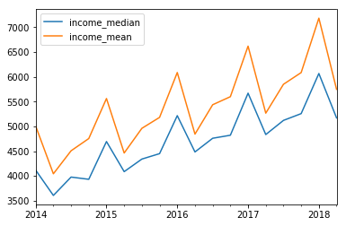
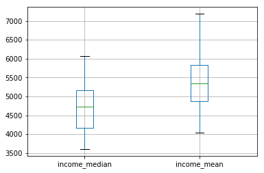
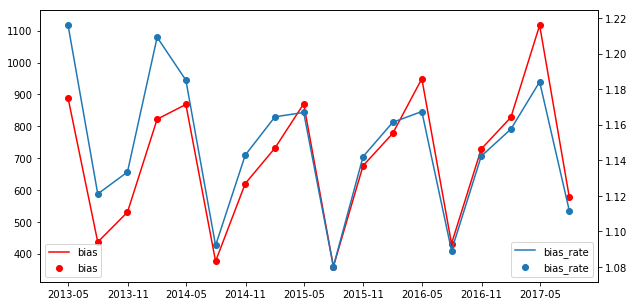

## 居民可支配收入
- 数据来源于中华人民共和国国家统计局：http://www.stats.gov.cn/
- 数据为2013年至2017年7月31日，频率为季度
- `income_median`表示居民可支配收入的中位数，`income_mean`表示居民可支配收入的平均数


```python
import pandas as pd
import matplotlib.pyplot as plt
```

### 导入数据，并做简单统计


```python
data = pd.read_csv('income.csv',usecols=['income_median','income_mean'])
index = pd.date_range('2/1/2013', '8/1/2017',freq='Q-JAN')
data.index = index
print(data.head())
print(data.describe())
```

                income_median  income_mean
    2013-04-30         4117.2       5006.1
    2013-07-31         3606.2       4043.0
    2013-10-31         3976.8       4507.4
    2014-01-31         3931.9       4754.3
    2014-04-30         4693.6       5562.2
           income_median  income_mean
    count      18.000000    18.000000
    mean     4700.211111  5399.833333
    std       645.640545   791.798087
    min      3606.200000  4043.000000
    25%      4172.950000  4873.000000
    50%      4726.800000  5351.550000
    75%      5158.275000  5824.025000
    max      6067.000000  7184.000000


### 画平均收入和中位数收入曲线


```python
data.plot()
plt.show()
```





### 画平均收入和中位数收入的箱线图


```python
data.boxplot()
plt.show()
```





### 计算平均数与中位数的差值并作图


```python
data['bias'] = data['income_mean'] - data['income_median']
data['bias_rate'] = data['income_mean'] / data['income_median']
print("收入中位数与收入平均值的差的平均：%.2f %%" %float(data['bias_rate'].mean()*100))
print("收入中位数与收入平均值的差的平均：%.2f " %float(data['bias'].mean()))

fig = plt.figure(figsize=(10,5))
ax1 = fig.add_subplot(111)
ax1.plot(data['bias'], c='r')
ax1.scatter(data.index, data['bias'], c='r')
ax1.legend(loc=3)

ax2 = ax1.twinx()
ax2.plot(data['bias_rate'])
ax2.scatter(data.index, data['bias_rate'])
ax2.legend(loc=4)
plt.show()
```

    收入中位数与收入平均值的差的平均：114.82 %
    收入中位数与收入平均值的差的平均：699.62





### 计算房价收入比（均值）合理区间
房价收入比公式为：
$$ratio_{median} = \frac{house_{median}}{income_{median}}$$

收入中位数与收入平均数的比值为：
$$rate = \frac{income_{median}}{income_{mean}}$$

所以如果用收入的平均数来计算，则区间为：
$$ratio_{mean}=\frac{house_{median}}{income_{mean}} = rate * \frac{house_{median}}{income_{median}} = rate * ratio_{median}$$

带入$rate=114.82\%$和$ratio_{median} \in [3,6]$，计算得到$ratio_{mean} \in [2.61, 5.23] $


```python

```
