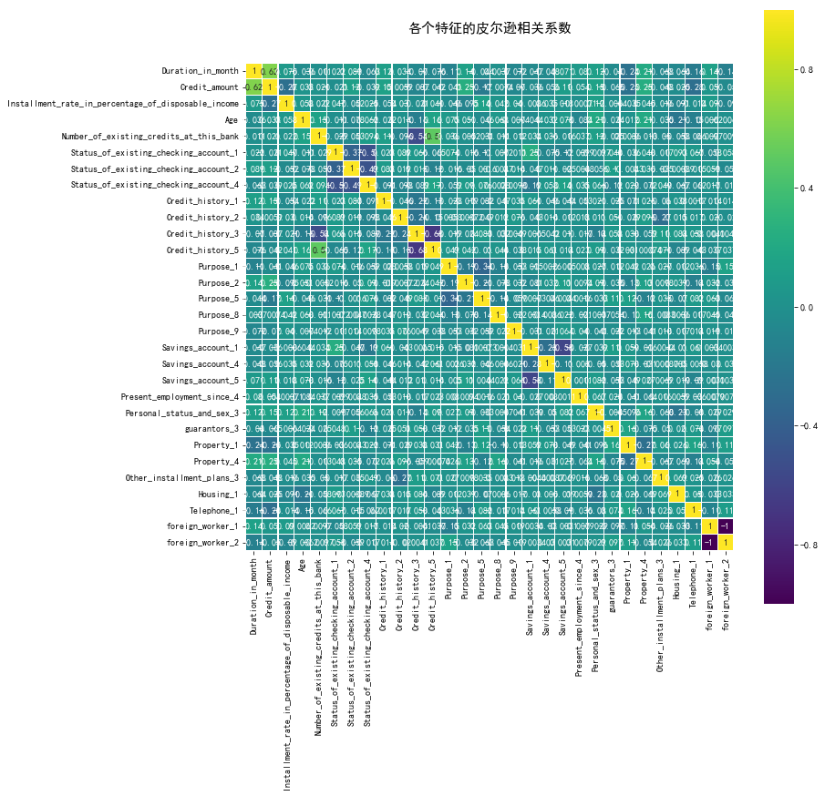
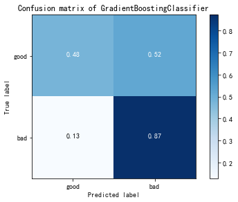

 # Table of Contents
<div class="toc" style="margin-top: 1em;"><ul class="toc-item" id="toc-level0"><li><span><a href="#数据预处理" data-toc-modified-id="数据预处理-1"><span class="toc-item-num">1&nbsp;&nbsp;</span>数据预处理</a></span><ul class="toc-item"><li><span><a href="#导入数据" data-toc-modified-id="导入数据-1.1"><span class="toc-item-num">1.1&nbsp;&nbsp;</span>导入数据</a></span></li><li><span><a href="#将有序文本数据转换为数值数据" data-toc-modified-id="将有序文本数据转换为数值数据-1.2"><span class="toc-item-num">1.2&nbsp;&nbsp;</span>将有序文本数据转换为数值数据</a></span></li><li><span><a href="#将无序文本数据用哑变量替换" data-toc-modified-id="将无序文本数据用哑变量替换-1.3"><span class="toc-item-num">1.3&nbsp;&nbsp;</span>将无序文本数据用哑变量替换</a></span></li><li><span><a href="#数据规范化" data-toc-modified-id="数据规范化-1.4"><span class="toc-item-num">1.4&nbsp;&nbsp;</span>数据规范化</a></span></li></ul></li><li><span><a href="#特征工程" data-toc-modified-id="特征工程-2"><span class="toc-item-num">2&nbsp;&nbsp;</span>特征工程</a></span><ul class="toc-item"><li><span><a href="#RFE筛选特征" data-toc-modified-id="RFE筛选特征-2.1"><span class="toc-item-num">2.1&nbsp;&nbsp;</span>RFE筛选特征</a></span></li><li><span><a href="#相关性分析" data-toc-modified-id="相关性分析-2.2"><span class="toc-item-num">2.2&nbsp;&nbsp;</span>相关性分析</a></span></li><li><span><a href="#Embedded" data-toc-modified-id="Embedded-2.3"><span class="toc-item-num">2.3&nbsp;&nbsp;</span>Embedded</a></span></li></ul></li><li><span><a href="#重采样" data-toc-modified-id="重采样-3"><span class="toc-item-num">3&nbsp;&nbsp;</span>重采样</a></span></li><li><span><a href="#模型训练与评价" data-toc-modified-id="模型训练与评价-4"><span class="toc-item-num">4&nbsp;&nbsp;</span>模型训练与评价</a></span><ul class="toc-item"><li><span><a href="#数据划分" data-toc-modified-id="数据划分-4.1"><span class="toc-item-num">4.1&nbsp;&nbsp;</span>数据划分</a></span></li><li><span><a href="#模型训练" data-toc-modified-id="模型训练-4.2"><span class="toc-item-num">4.2&nbsp;&nbsp;</span>模型训练</a></span><ul class="toc-item"><li><span><a href="#使用线性判别LDA分类" data-toc-modified-id="使用线性判别LDA分类-4.2.1"><span class="toc-item-num">4.2.1&nbsp;&nbsp;</span>使用线性判别LDA分类</a></span></li><li><span><a href="#使用决策树DecisionTree分类" data-toc-modified-id="使用决策树DecisionTree分类-4.2.2"><span class="toc-item-num">4.2.2&nbsp;&nbsp;</span>使用决策树DecisionTree分类</a></span></li><li><span><a href="#使用伯努利朴素贝叶斯Bernoulli-Naive-Bayes" data-toc-modified-id="使用伯努利朴素贝叶斯Bernoulli-Naive-Bayes-4.2.3"><span class="toc-item-num">4.2.3&nbsp;&nbsp;</span>使用伯努利朴素贝叶斯Bernoulli Naive Bayes</a></span></li><li><span><a href="#使用最邻近KNN算法" data-toc-modified-id="使用最邻近KNN算法-4.2.4"><span class="toc-item-num">4.2.4&nbsp;&nbsp;</span>使用最邻近KNN算法</a></span></li><li><span><a href="#使用Logistics回归" data-toc-modified-id="使用Logistics回归-4.2.5"><span class="toc-item-num">4.2.5&nbsp;&nbsp;</span>使用Logistics回归</a></span></li><li><span><a href="#使用SVM" data-toc-modified-id="使用SVM-4.2.6"><span class="toc-item-num">4.2.6&nbsp;&nbsp;</span>使用SVM</a></span></li></ul></li><li><span><a href="#结果评价" data-toc-modified-id="结果评价-4.3"><span class="toc-item-num">4.3&nbsp;&nbsp;</span>结果评价</a></span><ul class="toc-item"><li><span><a href="#Precision,-Recall,-F1-score,-Accuracy" data-toc-modified-id="Precision,-Recall,-F1-score,-Accuracy-4.3.1"><span class="toc-item-num">4.3.1&nbsp;&nbsp;</span>Precision, Recall, F1-score, Accuracy</a></span></li><li><span><a href="#Confusion-Matrix" data-toc-modified-id="Confusion-Matrix-4.3.2"><span class="toc-item-num">4.3.2&nbsp;&nbsp;</span>Confusion Matrix</a></span></li></ul></li></ul></li><li><span><a href="#网络搜索和交叉验证提升模型" data-toc-modified-id="网络搜索和交叉验证提升模型-5"><span class="toc-item-num">5&nbsp;&nbsp;</span>网络搜索和交叉验证提升模型</a></span><ul class="toc-item"><li><span><a href="#以-KNN-为例" data-toc-modified-id="以-KNN-为例-5.1"><span class="toc-item-num">5.1&nbsp;&nbsp;</span>以 KNN 为例</a></span></li></ul></li><li><span><a href="#集成算法" data-toc-modified-id="集成算法-6"><span class="toc-item-num">6&nbsp;&nbsp;</span>集成算法</a></span><ul class="toc-item"><li><span><a href="#随机森林" data-toc-modified-id="随机森林-6.1"><span class="toc-item-num">6.1&nbsp;&nbsp;</span>随机森林</a></span><ul class="toc-item"><li><span><a href="#极限随机树" data-toc-modified-id="极限随机树-6.1.1"><span class="toc-item-num">6.1.1&nbsp;&nbsp;</span>极限随机树</a></span></li></ul></li><li><span><a href="#AdaBoost" data-toc-modified-id="AdaBoost-6.2"><span class="toc-item-num">6.2&nbsp;&nbsp;</span>AdaBoost</a></span></li><li><span><a href="#梯度树提升（Gradient-Tree-Boosting）" data-toc-modified-id="梯度树提升（Gradient-Tree-Boosting）-6.3"><span class="toc-item-num">6.3&nbsp;&nbsp;</span>梯度树提升（Gradient Tree Boosting）</a></span></li><li><span><a href="#投票分类器" data-toc-modified-id="投票分类器-6.4"><span class="toc-item-num">6.4&nbsp;&nbsp;</span>投票分类器</a></span></li><li><span><a href="#网格搜索下的投票分类器" data-toc-modified-id="网格搜索下的投票分类器-6.5"><span class="toc-item-num">6.5&nbsp;&nbsp;</span>网格搜索下的投票分类器</a></span></li><li><span><a href="#模型评价" data-toc-modified-id="模型评价-6.6"><span class="toc-item-num">6.6&nbsp;&nbsp;</span>模型评价</a></span></li></ul></li></ul></div>


```python
import pandas as pd
import numpy as np
import matplotlib.pyplot as plt
import seaborn as sns
%matplotlib inline
from pyecharts import Pie
import missingno as msno
from sklearn import metrics as mt

from attr import *
from plot_comfusion_matrix import *
```

# 数据预处理

## 导入数据


```python
df = pd.read_excel('data_cn.xlsx')
df.loc[df.label ==2,'label'] = 0
df.head()
```


<div>
<style>
    .dataframe thead tr:only-child th {
        text-align: right;
    }

    .dataframe thead th {
        text-align: left;
    }

    .dataframe tbody tr th {
        vertical-align: top;
    }
</style>
<table border="1" class="dataframe">
  <thead>
    <tr style="text-align: right;">
      <th></th>
      <th>Status_of_existing_checking_account</th>
      <th>Duration_in_month</th>
      <th>Credit_history</th>
      <th>Purpose</th>
      <th>Credit_amount</th>
      <th>Savings_account</th>
      <th>Present_employment_since</th>
      <th>Installment_rate_in_percentage_of_disposable_income</th>
      <th>Personal_status_and_sex</th>
      <th>guarantors</th>
      <th>...</th>
      <th>Property</th>
      <th>Age</th>
      <th>Other_installment_plans</th>
      <th>Housing</th>
      <th>Number_of_existing_credits_at_this_bank</th>
      <th>Job</th>
      <th>Number_of_people_being_liable_to_provide_maintenance_for</th>
      <th>Telephone</th>
      <th>foreign_worker</th>
      <th>label</th>
    </tr>
  </thead>
  <tbody>
    <tr>
      <th>0</th>
      <td>A11</td>
      <td>6</td>
      <td>A34</td>
      <td>A43</td>
      <td>1169</td>
      <td>A65</td>
      <td>A75</td>
      <td>4</td>
      <td>A93</td>
      <td>A101</td>
      <td>...</td>
      <td>A121</td>
      <td>67</td>
      <td>A143</td>
      <td>A152</td>
      <td>2</td>
      <td>A173</td>
      <td>1</td>
      <td>A192</td>
      <td>A201</td>
      <td>1</td>
    </tr>
    <tr>
      <th>1</th>
      <td>A12</td>
      <td>48</td>
      <td>A32</td>
      <td>A43</td>
      <td>5951</td>
      <td>A61</td>
      <td>A73</td>
      <td>2</td>
      <td>A92</td>
      <td>A101</td>
      <td>...</td>
      <td>A121</td>
      <td>22</td>
      <td>A143</td>
      <td>A152</td>
      <td>1</td>
      <td>A173</td>
      <td>1</td>
      <td>A191</td>
      <td>A201</td>
      <td>0</td>
    </tr>
    <tr>
      <th>2</th>
      <td>A14</td>
      <td>12</td>
      <td>A34</td>
      <td>A46</td>
      <td>2096</td>
      <td>A61</td>
      <td>A74</td>
      <td>2</td>
      <td>A93</td>
      <td>A101</td>
      <td>...</td>
      <td>A121</td>
      <td>49</td>
      <td>A143</td>
      <td>A152</td>
      <td>1</td>
      <td>A172</td>
      <td>2</td>
      <td>A191</td>
      <td>A201</td>
      <td>1</td>
    </tr>
    <tr>
      <th>3</th>
      <td>A11</td>
      <td>42</td>
      <td>A32</td>
      <td>A42</td>
      <td>7882</td>
      <td>A61</td>
      <td>A74</td>
      <td>2</td>
      <td>A93</td>
      <td>A103</td>
      <td>...</td>
      <td>A122</td>
      <td>45</td>
      <td>A143</td>
      <td>A153</td>
      <td>1</td>
      <td>A173</td>
      <td>2</td>
      <td>A191</td>
      <td>A201</td>
      <td>1</td>
    </tr>
    <tr>
      <th>4</th>
      <td>A11</td>
      <td>24</td>
      <td>A33</td>
      <td>A40</td>
      <td>4870</td>
      <td>A61</td>
      <td>A73</td>
      <td>3</td>
      <td>A93</td>
      <td>A101</td>
      <td>...</td>
      <td>A124</td>
      <td>53</td>
      <td>A143</td>
      <td>A153</td>
      <td>2</td>
      <td>A173</td>
      <td>2</td>
      <td>A191</td>
      <td>A201</td>
      <td>0</td>
    </tr>
  </tbody>
</table>
<p>5 rows × 21 columns</p>
</div>


```python
df.info()
```

    <class 'pandas.core.frame.DataFrame'>
    RangeIndex: 1000 entries, 0 to 999
    Data columns (total 21 columns):
    Status_of_existing_checking_account                         1000 non-null object
    Duration_in_month                                           1000 non-null int64
    Credit_history                                              1000 non-null object
    Purpose                                                     1000 non-null object
    Credit_amount                                               1000 non-null int64
    Savings_account                                             1000 non-null object
    Present_employment_since                                    1000 non-null object
    Installment_rate_in_percentage_of_disposable_income         1000 non-null int64
    Personal_status_and_sex                                     1000 non-null object
    guarantors                                                  1000 non-null object
    Present_residence_since                                     1000 non-null int64
    Property                                                    1000 non-null object
    Age                                                         1000 non-null int64
    Other_installment_plans                                     1000 non-null object
    Housing                                                     1000 non-null object
    Number_of_existing_credits_at_this_bank                     1000 non-null int64
    Job                                                         1000 non-null object
    Number_of_people_being_liable_to_provide_maintenance_for    1000 non-null int64
    Telephone                                                   1000 non-null object
    foreign_worker                                              1000 non-null object
    label                                                       1000 non-null int64
    dtypes: int64(8), object(13)
    memory usage: 164.1+ KB


## 将有序文本数据转换为数值数据


```python
for key, value in maping.items():
    df[key].map(value)
df.head()
```


<div>
<style>
    .dataframe thead tr:only-child th {
        text-align: right;
    }

    .dataframe thead th {
        text-align: left;
    }

    .dataframe tbody tr th {
        vertical-align: top;
    }
</style>
<table border="1" class="dataframe">
  <thead>
    <tr style="text-align: right;">
      <th></th>
      <th>Status_of_existing_checking_account</th>
      <th>Duration_in_month</th>
      <th>Credit_history</th>
      <th>Purpose</th>
      <th>Credit_amount</th>
      <th>Savings_account</th>
      <th>Present_employment_since</th>
      <th>Installment_rate_in_percentage_of_disposable_income</th>
      <th>Personal_status_and_sex</th>
      <th>guarantors</th>
      <th>...</th>
      <th>Property</th>
      <th>Age</th>
      <th>Other_installment_plans</th>
      <th>Housing</th>
      <th>Number_of_existing_credits_at_this_bank</th>
      <th>Job</th>
      <th>Number_of_people_being_liable_to_provide_maintenance_for</th>
      <th>Telephone</th>
      <th>foreign_worker</th>
      <th>label</th>
    </tr>
  </thead>
  <tbody>
    <tr>
      <th>0</th>
      <td>A11</td>
      <td>6</td>
      <td>A34</td>
      <td>A43</td>
      <td>1169</td>
      <td>A65</td>
      <td>A75</td>
      <td>4</td>
      <td>A93</td>
      <td>A101</td>
      <td>...</td>
      <td>A121</td>
      <td>67</td>
      <td>A143</td>
      <td>A152</td>
      <td>2</td>
      <td>A173</td>
      <td>1</td>
      <td>A192</td>
      <td>A201</td>
      <td>1</td>
    </tr>
    <tr>
      <th>1</th>
      <td>A12</td>
      <td>48</td>
      <td>A32</td>
      <td>A43</td>
      <td>5951</td>
      <td>A61</td>
      <td>A73</td>
      <td>2</td>
      <td>A92</td>
      <td>A101</td>
      <td>...</td>
      <td>A121</td>
      <td>22</td>
      <td>A143</td>
      <td>A152</td>
      <td>1</td>
      <td>A173</td>
      <td>1</td>
      <td>A191</td>
      <td>A201</td>
      <td>0</td>
    </tr>
    <tr>
      <th>2</th>
      <td>A14</td>
      <td>12</td>
      <td>A34</td>
      <td>A46</td>
      <td>2096</td>
      <td>A61</td>
      <td>A74</td>
      <td>2</td>
      <td>A93</td>
      <td>A101</td>
      <td>...</td>
      <td>A121</td>
      <td>49</td>
      <td>A143</td>
      <td>A152</td>
      <td>1</td>
      <td>A172</td>
      <td>2</td>
      <td>A191</td>
      <td>A201</td>
      <td>1</td>
    </tr>
    <tr>
      <th>3</th>
      <td>A11</td>
      <td>42</td>
      <td>A32</td>
      <td>A42</td>
      <td>7882</td>
      <td>A61</td>
      <td>A74</td>
      <td>2</td>
      <td>A93</td>
      <td>A103</td>
      <td>...</td>
      <td>A122</td>
      <td>45</td>
      <td>A143</td>
      <td>A153</td>
      <td>1</td>
      <td>A173</td>
      <td>2</td>
      <td>A191</td>
      <td>A201</td>
      <td>1</td>
    </tr>
    <tr>
      <th>4</th>
      <td>A11</td>
      <td>24</td>
      <td>A33</td>
      <td>A40</td>
      <td>4870</td>
      <td>A61</td>
      <td>A73</td>
      <td>3</td>
      <td>A93</td>
      <td>A101</td>
      <td>...</td>
      <td>A124</td>
      <td>53</td>
      <td>A143</td>
      <td>A153</td>
      <td>2</td>
      <td>A173</td>
      <td>2</td>
      <td>A191</td>
      <td>A201</td>
      <td>0</td>
    </tr>
  </tbody>
</table>
<p>5 rows × 21 columns</p>
</div>


## 将无序文本数据用哑变量替换


```python
from sklearn.preprocessing import OneHotEncoder
cols_orderless = df.select_dtypes(include=['object']).columns
for col in cols_orderless:
    df[col] = np.unique(df[col], return_inverse=True)[1]
    for i in range(pd.value_counts(df[col]).count()):
        df[col+'_'+str(i+1)] = OneHotEncoder().fit_transform(df[col].values.reshape([-1,1])).toarray()[:, i]
    df.drop(col, axis=1 ,inplace=True)
df.head()
```


<div>
<style>
    .dataframe thead tr:only-child th {
        text-align: right;
    }

    .dataframe thead th {
        text-align: left;
    }

    .dataframe tbody tr th {
        vertical-align: top;
    }
</style>
<table border="1" class="dataframe">
  <thead>
    <tr style="text-align: right;">
      <th></th>
      <th>Duration_in_month</th>
      <th>Credit_amount</th>
      <th>Installment_rate_in_percentage_of_disposable_income</th>
      <th>Present_residence_since</th>
      <th>Age</th>
      <th>Number_of_existing_credits_at_this_bank</th>
      <th>Number_of_people_being_liable_to_provide_maintenance_for</th>
      <th>label</th>
      <th>Status_of_existing_checking_account_1</th>
      <th>Status_of_existing_checking_account_2</th>
      <th>...</th>
      <th>Housing_2</th>
      <th>Housing_3</th>
      <th>Job_1</th>
      <th>Job_2</th>
      <th>Job_3</th>
      <th>Job_4</th>
      <th>Telephone_1</th>
      <th>Telephone_2</th>
      <th>foreign_worker_1</th>
      <th>foreign_worker_2</th>
    </tr>
  </thead>
  <tbody>
    <tr>
      <th>0</th>
      <td>6</td>
      <td>1169</td>
      <td>4</td>
      <td>4</td>
      <td>67</td>
      <td>2</td>
      <td>1</td>
      <td>1</td>
      <td>1.0</td>
      <td>0.0</td>
      <td>...</td>
      <td>1.0</td>
      <td>0.0</td>
      <td>0.0</td>
      <td>0.0</td>
      <td>1.0</td>
      <td>0.0</td>
      <td>0.0</td>
      <td>1.0</td>
      <td>1.0</td>
      <td>0.0</td>
    </tr>
    <tr>
      <th>1</th>
      <td>48</td>
      <td>5951</td>
      <td>2</td>
      <td>2</td>
      <td>22</td>
      <td>1</td>
      <td>1</td>
      <td>0</td>
      <td>0.0</td>
      <td>1.0</td>
      <td>...</td>
      <td>1.0</td>
      <td>0.0</td>
      <td>0.0</td>
      <td>0.0</td>
      <td>1.0</td>
      <td>0.0</td>
      <td>1.0</td>
      <td>0.0</td>
      <td>1.0</td>
      <td>0.0</td>
    </tr>
    <tr>
      <th>2</th>
      <td>12</td>
      <td>2096</td>
      <td>2</td>
      <td>3</td>
      <td>49</td>
      <td>1</td>
      <td>2</td>
      <td>1</td>
      <td>0.0</td>
      <td>0.0</td>
      <td>...</td>
      <td>1.0</td>
      <td>0.0</td>
      <td>0.0</td>
      <td>1.0</td>
      <td>0.0</td>
      <td>0.0</td>
      <td>1.0</td>
      <td>0.0</td>
      <td>1.0</td>
      <td>0.0</td>
    </tr>
    <tr>
      <th>3</th>
      <td>42</td>
      <td>7882</td>
      <td>2</td>
      <td>4</td>
      <td>45</td>
      <td>1</td>
      <td>2</td>
      <td>1</td>
      <td>1.0</td>
      <td>0.0</td>
      <td>...</td>
      <td>0.0</td>
      <td>1.0</td>
      <td>0.0</td>
      <td>0.0</td>
      <td>1.0</td>
      <td>0.0</td>
      <td>1.0</td>
      <td>0.0</td>
      <td>1.0</td>
      <td>0.0</td>
    </tr>
    <tr>
      <th>4</th>
      <td>24</td>
      <td>4870</td>
      <td>3</td>
      <td>4</td>
      <td>53</td>
      <td>2</td>
      <td>2</td>
      <td>0</td>
      <td>1.0</td>
      <td>0.0</td>
      <td>...</td>
      <td>0.0</td>
      <td>1.0</td>
      <td>0.0</td>
      <td>0.0</td>
      <td>1.0</td>
      <td>0.0</td>
      <td>1.0</td>
      <td>0.0</td>
      <td>1.0</td>
      <td>0.0</td>
    </tr>
  </tbody>
</table>
<p>5 rows × 62 columns</p>
</div>


## 数据规范化


```python
from sklearn.preprocessing import scale
cols = df.drop('label', axis=1).columns
df[cols] = scale(df[cols])
df.head()
```


<div>
<style>
    .dataframe thead tr:only-child th {
        text-align: right;
    }

    .dataframe thead th {
        text-align: left;
    }

    .dataframe tbody tr th {
        vertical-align: top;
    }
</style>
<table border="1" class="dataframe">
  <thead>
    <tr style="text-align: right;">
      <th></th>
      <th>Duration_in_month</th>
      <th>Credit_amount</th>
      <th>Installment_rate_in_percentage_of_disposable_income</th>
      <th>Present_residence_since</th>
      <th>Age</th>
      <th>Number_of_existing_credits_at_this_bank</th>
      <th>Number_of_people_being_liable_to_provide_maintenance_for</th>
      <th>label</th>
      <th>Status_of_existing_checking_account_1</th>
      <th>Status_of_existing_checking_account_2</th>
      <th>...</th>
      <th>Housing_2</th>
      <th>Housing_3</th>
      <th>Job_1</th>
      <th>Job_2</th>
      <th>Job_3</th>
      <th>Job_4</th>
      <th>Telephone_1</th>
      <th>Telephone_2</th>
      <th>foreign_worker_1</th>
      <th>foreign_worker_2</th>
    </tr>
  </thead>
  <tbody>
    <tr>
      <th>0</th>
      <td>-1.236478</td>
      <td>-0.745131</td>
      <td>0.918477</td>
      <td>1.046987</td>
      <td>2.766456</td>
      <td>1.027079</td>
      <td>-0.428290</td>
      <td>1</td>
      <td>1.627770</td>
      <td>-0.606621</td>
      <td>...</td>
      <td>0.634448</td>
      <td>-0.347960</td>
      <td>-0.149983</td>
      <td>-0.5</td>
      <td>0.766356</td>
      <td>-0.416784</td>
      <td>-1.214598</td>
      <td>1.214598</td>
      <td>0.196014</td>
      <td>-0.196014</td>
    </tr>
    <tr>
      <th>1</th>
      <td>2.248194</td>
      <td>0.949817</td>
      <td>-0.870183</td>
      <td>-0.765977</td>
      <td>-1.191404</td>
      <td>-0.704926</td>
      <td>-0.428290</td>
      <td>0</td>
      <td>-0.614337</td>
      <td>1.648476</td>
      <td>...</td>
      <td>0.634448</td>
      <td>-0.347960</td>
      <td>-0.149983</td>
      <td>-0.5</td>
      <td>0.766356</td>
      <td>-0.416784</td>
      <td>0.823318</td>
      <td>-0.823318</td>
      <td>0.196014</td>
      <td>-0.196014</td>
    </tr>
    <tr>
      <th>2</th>
      <td>-0.738668</td>
      <td>-0.416562</td>
      <td>-0.870183</td>
      <td>0.140505</td>
      <td>1.183312</td>
      <td>-0.704926</td>
      <td>2.334869</td>
      <td>1</td>
      <td>-0.614337</td>
      <td>-0.606621</td>
      <td>...</td>
      <td>0.634448</td>
      <td>-0.347960</td>
      <td>-0.149983</td>
      <td>2.0</td>
      <td>-1.304877</td>
      <td>-0.416784</td>
      <td>0.823318</td>
      <td>-0.823318</td>
      <td>0.196014</td>
      <td>-0.196014</td>
    </tr>
    <tr>
      <th>3</th>
      <td>1.750384</td>
      <td>1.634247</td>
      <td>-0.870183</td>
      <td>1.046987</td>
      <td>0.831502</td>
      <td>-0.704926</td>
      <td>2.334869</td>
      <td>1</td>
      <td>1.627770</td>
      <td>-0.606621</td>
      <td>...</td>
      <td>-1.576173</td>
      <td>2.873893</td>
      <td>-0.149983</td>
      <td>-0.5</td>
      <td>0.766356</td>
      <td>-0.416784</td>
      <td>0.823318</td>
      <td>-0.823318</td>
      <td>0.196014</td>
      <td>-0.196014</td>
    </tr>
    <tr>
      <th>4</th>
      <td>0.256953</td>
      <td>0.566664</td>
      <td>0.024147</td>
      <td>1.046987</td>
      <td>1.535122</td>
      <td>1.027079</td>
      <td>2.334869</td>
      <td>0</td>
      <td>1.627770</td>
      <td>-0.606621</td>
      <td>...</td>
      <td>-1.576173</td>
      <td>2.873893</td>
      <td>-0.149983</td>
      <td>-0.5</td>
      <td>0.766356</td>
      <td>-0.416784</td>
      <td>0.823318</td>
      <td>-0.823318</td>
      <td>0.196014</td>
      <td>-0.196014</td>
    </tr>
  </tbody>
</table>
<p>5 rows × 62 columns</p>
</div>


# 特征工程

## RFE筛选特征


```python
from sklearn.feature_selection import RFE
from sklearn.linear_model import LogisticRegression
X_val = df.drop('label', axis=1)
y_val = df['label']
rfe = RFE(estimator=LogisticRegression(), n_features_to_select=30).fit(X_val, y_val)
```

查看被筛选掉的特征


```python
X_val.columns[rfe.support_ == False]
```


    Index(['Present_residence_since',
           'Number_of_people_being_liable_to_provide_maintenance_for',
           'Status_of_existing_checking_account_3', 'Credit_history_4',
           'Purpose_3', 'Purpose_4', 'Purpose_6', 'Purpose_7', 'Purpose_10',
           'Savings_account_2', 'Savings_account_3', 'Present_employment_since_1',
           'Present_employment_since_2', 'Present_employment_since_3',
           'Present_employment_since_5', 'Personal_status_and_sex_1',
           'Personal_status_and_sex_2', 'Personal_status_and_sex_4',
           'guarantors_1', 'guarantors_2', 'Property_2', 'Property_3',
           'Other_installment_plans_1', 'Other_installment_plans_2', 'Housing_2',
           'Housing_3', 'Job_1', 'Job_2', 'Job_3', 'Job_4', 'Telephone_2'],
          dtype='object')


保留未被筛选掉的特征


```python
X_val = X_val.iloc[:, rfe.support_]
```


```python
X_val.head()
```


<div>
<style>
    .dataframe thead tr:only-child th {
        text-align: right;
    }

    .dataframe thead th {
        text-align: left;
    }

    .dataframe tbody tr th {
        vertical-align: top;
    }
</style>
<table border="1" class="dataframe">
  <thead>
    <tr style="text-align: right;">
      <th></th>
      <th>Duration_in_month</th>
      <th>Credit_amount</th>
      <th>Installment_rate_in_percentage_of_disposable_income</th>
      <th>Age</th>
      <th>Number_of_existing_credits_at_this_bank</th>
      <th>Status_of_existing_checking_account_1</th>
      <th>Status_of_existing_checking_account_2</th>
      <th>Status_of_existing_checking_account_4</th>
      <th>Credit_history_1</th>
      <th>Credit_history_2</th>
      <th>...</th>
      <th>Present_employment_since_4</th>
      <th>Personal_status_and_sex_3</th>
      <th>guarantors_3</th>
      <th>Property_1</th>
      <th>Property_4</th>
      <th>Other_installment_plans_3</th>
      <th>Housing_1</th>
      <th>Telephone_1</th>
      <th>foreign_worker_1</th>
      <th>foreign_worker_2</th>
    </tr>
  </thead>
  <tbody>
    <tr>
      <th>0</th>
      <td>-1.236478</td>
      <td>-0.745131</td>
      <td>0.918477</td>
      <td>2.766456</td>
      <td>1.027079</td>
      <td>1.627770</td>
      <td>-0.606621</td>
      <td>-0.806328</td>
      <td>-0.204124</td>
      <td>-0.226991</td>
      <td>...</td>
      <td>-0.45897</td>
      <td>0.908195</td>
      <td>-0.234206</td>
      <td>1.595650</td>
      <td>-0.426653</td>
      <td>0.478018</td>
      <td>-0.466933</td>
      <td>-1.214598</td>
      <td>0.196014</td>
      <td>-0.196014</td>
    </tr>
    <tr>
      <th>1</th>
      <td>2.248194</td>
      <td>0.949817</td>
      <td>-0.870183</td>
      <td>-1.191404</td>
      <td>-0.704926</td>
      <td>-0.614337</td>
      <td>1.648476</td>
      <td>-0.806328</td>
      <td>-0.204124</td>
      <td>-0.226991</td>
      <td>...</td>
      <td>-0.45897</td>
      <td>-1.101086</td>
      <td>-0.234206</td>
      <td>1.595650</td>
      <td>-0.426653</td>
      <td>0.478018</td>
      <td>-0.466933</td>
      <td>0.823318</td>
      <td>0.196014</td>
      <td>-0.196014</td>
    </tr>
    <tr>
      <th>2</th>
      <td>-0.738668</td>
      <td>-0.416562</td>
      <td>-0.870183</td>
      <td>1.183312</td>
      <td>-0.704926</td>
      <td>-0.614337</td>
      <td>-0.606621</td>
      <td>1.240190</td>
      <td>-0.204124</td>
      <td>-0.226991</td>
      <td>...</td>
      <td>2.17879</td>
      <td>0.908195</td>
      <td>-0.234206</td>
      <td>1.595650</td>
      <td>-0.426653</td>
      <td>0.478018</td>
      <td>-0.466933</td>
      <td>0.823318</td>
      <td>0.196014</td>
      <td>-0.196014</td>
    </tr>
    <tr>
      <th>3</th>
      <td>1.750384</td>
      <td>1.634247</td>
      <td>-0.870183</td>
      <td>0.831502</td>
      <td>-0.704926</td>
      <td>1.627770</td>
      <td>-0.606621</td>
      <td>-0.806328</td>
      <td>-0.204124</td>
      <td>-0.226991</td>
      <td>...</td>
      <td>2.17879</td>
      <td>0.908195</td>
      <td>4.269750</td>
      <td>-0.626704</td>
      <td>-0.426653</td>
      <td>0.478018</td>
      <td>-0.466933</td>
      <td>0.823318</td>
      <td>0.196014</td>
      <td>-0.196014</td>
    </tr>
    <tr>
      <th>4</th>
      <td>0.256953</td>
      <td>0.566664</td>
      <td>0.024147</td>
      <td>1.535122</td>
      <td>1.027079</td>
      <td>1.627770</td>
      <td>-0.606621</td>
      <td>-0.806328</td>
      <td>-0.204124</td>
      <td>-0.226991</td>
      <td>...</td>
      <td>-0.45897</td>
      <td>0.908195</td>
      <td>-0.234206</td>
      <td>-0.626704</td>
      <td>2.343823</td>
      <td>0.478018</td>
      <td>-0.466933</td>
      <td>0.823318</td>
      <td>0.196014</td>
      <td>-0.196014</td>
    </tr>
  </tbody>
</table>
<p>5 rows × 30 columns</p>
</div>


## 相关性分析


```python
plt.figure(figsize=(12,12))
plt.title('各个特征的皮尔逊相关系数', y=1.05, size=15)
sns.heatmap(X_val.corr(),linewidths=0.1,vmax=1.0, square=True, cmap=plt.cm.viridis, linecolor='white', annot=True)
```


    <matplotlib.axes._subplots.AxesSubplot at 0x25c36928ba8>





```python
X_val.drop('foreign_worker_2', axis=1, inplace=True)
```


```python
plt.figure(figsize=(12,12))
plt.title('各个特征的皮尔逊相关系数', y=1.05, size=15)
sns.heatmap(X_val.corr(),linewidths=0.1,vmax=1.0, square=True, cmap=plt.cm.viridis, linecolor='white', annot=True)
```


    <matplotlib.axes._subplots.AxesSubplot at 0x25c36c65630>


## Embedded


```python
from sklearn.ensemble import RandomForestClassifier
clf=RandomForestClassifier(n_estimators=20)   #构建分类随机森林分类器

clf.fit(X_val, y_val) #对自变量和因变量进行拟合
for i, score in enumerate(clf.feature_importances_):
    print(X_val.columns[i], '\t\t',score)
    if score < 0.01:
        print()
        print('不要的特征:', X_val.columns[i])
        print()
```

    Duration_in_month 		 0.109518188865
    Credit_amount 		 0.15750984933
    Installment_rate_in_percentage_of_disposable_income 		 0.0589523531786
    Age 		 0.123632471707
    Number_of_existing_credits_at_this_bank 		 0.0289180343327
    Status_of_existing_checking_account_1 		 0.0559697840993
    Status_of_existing_checking_account_2 		 0.0363934048045
    Status_of_existing_checking_account_4 		 0.0313215632037
    Credit_history_1 		 0.0164216669871
    Credit_history_2 		 0.0134495141705
    Credit_history_3 		 0.0222631542981
    Credit_history_5 		 0.0328904506053
    Purpose_1 		 0.0256921560515
    Purpose_2 		 0.0130205883787
    Purpose_5 		 0.0221490882456
    Purpose_8 		 0.0134919509788
    Purpose_9 		 0.00320983204385

    不要的特征: Purpose_9

    Savings_account_1 		 0.0282526457623
    Savings_account_4 		 0.00885029260625

    不要的特征: Savings_account_4

    Savings_account_5 		 0.0175097800863
    Present_employment_since_4 		 0.0158101510065
    Personal_status_and_sex_3 		 0.0291493110169
    guarantors_3 		 0.0128600750858
    Property_1 		 0.0270253720512
    Property_4 		 0.0187056116726
    Other_installment_plans_3 		 0.0265226746788
    Housing_1 		 0.0192242043361
    Telephone_1 		 0.0241806468915
    foreign_worker_1 		 0.00710518352569

    不要的特征: foreign_worker_1


可视化


```python
## feature importances 可视化##
importances = clf.feature_importances_
feat_names = X_val.columns
indices = np.argsort(importances)[::-1]
fig = plt.figure(figsize=(20,6))
plt.title("Feature importances by RandomTreeClassifier")
plt.bar(range(len(indices)), importances[indices], color='lightblue',  align="center")
plt.step(range(len(indices)), np.cumsum(importances[indices]), where='mid', label='Cumulative')
plt.xticks(range(len(indices)), feat_names[indices], rotation='vertical',fontsize=14)
plt.xlim([-1, len(indices)])
plt.show()
```


```python
cols_filted = ['Purpose_9', 'Savings_account_4', 'foreign_worker_1']
X_val.drop(cols_filted, axis=1, inplace=True)
X_val.head()
```


<div>
<style>
    .dataframe thead tr:only-child th {
        text-align: right;
    }

    .dataframe thead th {
        text-align: left;
    }

    .dataframe tbody tr th {
        vertical-align: top;
    }
</style>
<table border="1" class="dataframe">
  <thead>
    <tr style="text-align: right;">
      <th></th>
      <th>Duration_in_month</th>
      <th>Credit_amount</th>
      <th>Installment_rate_in_percentage_of_disposable_income</th>
      <th>Age</th>
      <th>Number_of_existing_credits_at_this_bank</th>
      <th>Status_of_existing_checking_account_1</th>
      <th>Status_of_existing_checking_account_2</th>
      <th>Status_of_existing_checking_account_4</th>
      <th>Credit_history_1</th>
      <th>Credit_history_2</th>
      <th>...</th>
      <th>Savings_account_1</th>
      <th>Savings_account_5</th>
      <th>Present_employment_since_4</th>
      <th>Personal_status_and_sex_3</th>
      <th>guarantors_3</th>
      <th>Property_1</th>
      <th>Property_4</th>
      <th>Other_installment_plans_3</th>
      <th>Housing_1</th>
      <th>Telephone_1</th>
    </tr>
  </thead>
  <tbody>
    <tr>
      <th>0</th>
      <td>-1.236478</td>
      <td>-0.745131</td>
      <td>0.918477</td>
      <td>2.766456</td>
      <td>1.027079</td>
      <td>1.627770</td>
      <td>-0.606621</td>
      <td>-0.806328</td>
      <td>-0.204124</td>
      <td>-0.226991</td>
      <td>...</td>
      <td>-1.232433</td>
      <td>2.112932</td>
      <td>-0.45897</td>
      <td>0.908195</td>
      <td>-0.234206</td>
      <td>1.595650</td>
      <td>-0.426653</td>
      <td>0.478018</td>
      <td>-0.466933</td>
      <td>-1.214598</td>
    </tr>
    <tr>
      <th>1</th>
      <td>2.248194</td>
      <td>0.949817</td>
      <td>-0.870183</td>
      <td>-1.191404</td>
      <td>-0.704926</td>
      <td>-0.614337</td>
      <td>1.648476</td>
      <td>-0.806328</td>
      <td>-0.204124</td>
      <td>-0.226991</td>
      <td>...</td>
      <td>0.811403</td>
      <td>-0.473276</td>
      <td>-0.45897</td>
      <td>-1.101086</td>
      <td>-0.234206</td>
      <td>1.595650</td>
      <td>-0.426653</td>
      <td>0.478018</td>
      <td>-0.466933</td>
      <td>0.823318</td>
    </tr>
    <tr>
      <th>2</th>
      <td>-0.738668</td>
      <td>-0.416562</td>
      <td>-0.870183</td>
      <td>1.183312</td>
      <td>-0.704926</td>
      <td>-0.614337</td>
      <td>-0.606621</td>
      <td>1.240190</td>
      <td>-0.204124</td>
      <td>-0.226991</td>
      <td>...</td>
      <td>0.811403</td>
      <td>-0.473276</td>
      <td>2.17879</td>
      <td>0.908195</td>
      <td>-0.234206</td>
      <td>1.595650</td>
      <td>-0.426653</td>
      <td>0.478018</td>
      <td>-0.466933</td>
      <td>0.823318</td>
    </tr>
    <tr>
      <th>3</th>
      <td>1.750384</td>
      <td>1.634247</td>
      <td>-0.870183</td>
      <td>0.831502</td>
      <td>-0.704926</td>
      <td>1.627770</td>
      <td>-0.606621</td>
      <td>-0.806328</td>
      <td>-0.204124</td>
      <td>-0.226991</td>
      <td>...</td>
      <td>0.811403</td>
      <td>-0.473276</td>
      <td>2.17879</td>
      <td>0.908195</td>
      <td>4.269750</td>
      <td>-0.626704</td>
      <td>-0.426653</td>
      <td>0.478018</td>
      <td>-0.466933</td>
      <td>0.823318</td>
    </tr>
    <tr>
      <th>4</th>
      <td>0.256953</td>
      <td>0.566664</td>
      <td>0.024147</td>
      <td>1.535122</td>
      <td>1.027079</td>
      <td>1.627770</td>
      <td>-0.606621</td>
      <td>-0.806328</td>
      <td>-0.204124</td>
      <td>-0.226991</td>
      <td>...</td>
      <td>0.811403</td>
      <td>-0.473276</td>
      <td>-0.45897</td>
      <td>0.908195</td>
      <td>-0.234206</td>
      <td>-0.626704</td>
      <td>2.343823</td>
      <td>0.478018</td>
      <td>-0.466933</td>
      <td>0.823318</td>
    </tr>
  </tbody>
</table>
<p>5 rows × 26 columns</p>
</div>


# 重采样
处理数据不平衡


```python
plt.pie([pd.value_counts(y_val)[0], pd.value_counts(y_val)[1]], explode=(0.1,0), labels=[ 'bad', 'good'], autopct='%1.1f%%',
        shadow=True, startangle=90)
_ = plt.axis('equal')  # Equal aspect ratio ensures that pie is drawn as a circle.
```


通过Logistic训练数据，移除低概率数据


```python
from collections import Counter
from imblearn.under_sampling import InstanceHardnessThreshold
iht = InstanceHardnessThreshold(random_state=0, estimator=LogisticRegression())
X_resampled, y_resampled = iht.fit_sample(X_val, y_val)
print(sorted(Counter(y_resampled).items()))
```

    [(0, 300), (1, 300)]


```python
plt.pie([len(y_resampled[y_resampled == 0]), len(y_resampled[y_resampled == 1])], explode=(0.1,0), labels=[ 'bad', 'good'], autopct='%1.1f%%',
        shadow=True, startangle=90)
_ = plt.axis('equal')  # Equal aspect ratio ensures that pie is drawn as a circle.

```


# 模型训练与评价

## 数据划分


```python
from sklearn.model_selection import train_test_split
#X_train, X_test, y_train, y_test = train_test_split(X_resampled, y_resampled)
```


```python
## 不重采样
X_train, X_test, y_train, y_test = train_test_split(X_val, y_val)
```


```python
from imblearn.under_sampling import InstanceHardnessThreshold
from imblearn.over_sampling import SMOTE
iht = InstanceHardnessThreshold(random_state=0, estimator=LogisticRegression())
#X_train, y_train = iht.fit_sample(X_train, y_train)
#X_test, y_test = iht.fit_sample(X_test, y_test)
#sm = SMOTE()
#X_test, y_test = sm.fit_sample(X_test, y_test)
```

## 模型训练

### 使用线性判别LDA分类


```python
from sklearn.discriminant_analysis import LinearDiscriminantAnalysis
lda = LinearDiscriminantAnalysis()
lda.fit(X_train, y_train)
```


    LinearDiscriminantAnalysis(n_components=None, priors=None, shrinkage=None,
                  solver='svd', store_covariance=False, tol=0.0001)


### 使用决策树DecisionTree分类


```python
from sklearn.tree import DecisionTreeClassifier
dtc = DecisionTreeClassifier()
dtc.fit(X_train, y_train)
```


    DecisionTreeClassifier(class_weight=None, criterion='gini', max_depth=None,
                max_features=None, max_leaf_nodes=None,
                min_impurity_decrease=0.0, min_impurity_split=None,
                min_samples_leaf=1, min_samples_split=2,
                min_weight_fraction_leaf=0.0, presort=False, random_state=None,
                splitter='best')


### 使用伯努利朴素贝叶斯Bernoulli Naive Bayes


```python
from sklearn.naive_bayes import BernoulliNB
bnb = BernoulliNB()
bnb.fit(X_train, y_train)
```


    BernoulliNB(alpha=1.0, binarize=0.0, class_prior=None, fit_prior=True)


### 使用最邻近KNN算法


```python
from sklearn.neighbors import KNeighborsClassifier
knn = KNeighborsClassifier()
knn.fit(X_train, y_train)
```


    KNeighborsClassifier(algorithm='auto', leaf_size=30, metric='minkowski',
               metric_params=None, n_jobs=1, n_neighbors=5, p=2,
               weights='uniform')


### 使用Logistics回归


```python
from sklearn.linear_model import LogisticRegression
lg = LogisticRegression()
lg.fit(X_train, y_train)
```


    LogisticRegression(C=1.0, class_weight=None, dual=False, fit_intercept=True,
              intercept_scaling=1, max_iter=100, multi_class='ovr', n_jobs=1,
              penalty='l2', random_state=None, solver='liblinear', tol=0.0001,
              verbose=0, warm_start=False)


### 使用SVM


```python
from sklearn.svm import SVC
svc = SVC(kernel='rbf')
svc.fit(X_train, y_train)
```


    SVC(C=1.0, cache_size=200, class_weight=None, coef0=0.0,
      decision_function_shape='ovr', degree=3, gamma='auto', kernel='rbf',
      max_iter=-1, probability=False, random_state=None, shrinking=True,
      tol=0.001, verbose=False)


## 结果评价


```python
models = dict(LDA=lda, DecisionTree=dtc, BernoulliNB=bnb, KNN=knn, LogisticRegression=lg, SupportVectorMachine=svc)
```

###  Precision, Recall, F1-score, Accuracy


```python
from sklearn import metrics
for name, model in models.items():
    print(name)
    print(metrics.classification_report(y_test, model.predict(X_test)))
    print('Accuracy:\t', metrics.accuracy_score(y_test, model.predict(X_test)))
    print('________________________________________________________')
```

    LDA
                 precision    recall  f1-score   support

              0       0.61      0.58      0.59        71
              1       0.84      0.85      0.85       179

    avg / total       0.77      0.78      0.77       250

    Accuracy:	 0.776
    ________________________________________________________
    DecisionTree
                 precision    recall  f1-score   support

              0       0.48      0.48      0.48        71
              1       0.79      0.79      0.79       179

    avg / total       0.70      0.70      0.70       250

    Accuracy:	 0.704
    ________________________________________________________
    BernoulliNB
                 precision    recall  f1-score   support

              0       0.59      0.59      0.59        71
              1       0.84      0.84      0.84       179

    avg / total       0.77      0.77      0.77       250

    Accuracy:	 0.768
    ________________________________________________________
    KNN
                 precision    recall  f1-score   support

              0       0.53      0.41      0.46        71
              1       0.78      0.85      0.82       179

    avg / total       0.71      0.73      0.72       250

    Accuracy:	 0.728
    ________________________________________________________
    LogisticRegression
                 precision    recall  f1-score   support

              0       0.67      0.56      0.61        71
              1       0.84      0.89      0.86       179

    avg / total       0.79      0.80      0.79       250

    Accuracy:	 0.796
    ________________________________________________________
    SupportVectorMachine
                 precision    recall  f1-score   support

              0       0.62      0.46      0.53        71
              1       0.81      0.89      0.85       179

    avg / total       0.75      0.77      0.76       250

    Accuracy:	 0.768
    ________________________________________________________


### Confusion Matrix


```python
from sklearn.metrics import confusion_matrix
from plot_comfusion_matrix import *

for name,model in models.items():
    cm = confusion_matrix(y_test, model.predict(X_test))    
    plot_confusion_matrix(cm, classes=['good', 'bad'], normalize=True, title='Confusion matrix of {}'.format(name))
    plt.show()
    print('\n\n')
```

    Normalized confusion matrix
    [[ 0.57746479  0.42253521]
     [ 0.1452514   0.8547486 ]]


    Normalized confusion matrix
    [[ 0.47887324  0.52112676]
     [ 0.20670391  0.79329609]]


    Normalized confusion matrix
    [[ 0.5915493   0.4084507 ]
     [ 0.16201117  0.83798883]]


    Normalized confusion matrix
    [[ 0.4084507  0.5915493]
     [ 0.1452514  0.8547486]]


    Normalized confusion matrix
    [[ 0.56338028  0.43661972]
     [ 0.11173184  0.88826816]]


    Normalized confusion matrix
    [[ 0.46478873  0.53521127]
     [ 0.11173184  0.88826816]]


# 网络搜索和交叉验证提升模型

## 以 KNN 为例


```python
from sklearn.model_selection import RandomizedSearchCV
from sklearn.neighbors import KNeighborsClassifier

knn_ = KNeighborsClassifier()
k_range = list(range(1,20))
weight_options = ['uniform', 'distance']
kernel = ['linear', 'poly', 'rbf', 'sigmoid', 'precomputed']
algorithm = ['auto', 'ball_tree', 'kd_tree', 'brute']
param_knn = dict(n_neighbors=k_range, weights=weight_options, algorithm=algorithm)

RSCV_knn = RandomizedSearchCV(knn_, param_knn, cv=10, scoring='accuracy', n_iter=10, random_state=5)
RSCV_knn.fit(X_train, y_train)
print("knn_best:%f" % metrics.accuracy_score(y_test, RSCV_knn.predict(X_test)))
```

    knn_best:0.748000


```python
plot_confusion_matrix(confusion_matrix(y_test, RSCV_knn.predict(X_test)) ,
                      classes=['good', 'bad'], normalize=True, title='Confusion matrix of best KNN')
print(metrics.classification_report(y_test, RSCV_knn.predict(X_test)))
```

    Normalized confusion matrix
    [[ 0.30985915  0.69014085]
     [ 0.07821229  0.92178771]]
                 precision    recall  f1-score   support

              0       0.61      0.31      0.41        71
              1       0.77      0.92      0.84       179

    avg / total       0.73      0.75      0.72       250


# 集成算法

## 随机森林


```python
from sklearn.ensemble import RandomForestClassifier
rfc = RandomForestClassifier(n_estimators=15,random_state=1)
rfc.fit(X_train, y_train)
rfc.score(X_test, y_test)     
```


    0.74399999999999999


### 极限随机树


```python
from sklearn.ensemble import ExtraTreesClassifier
from sklearn.model_selection import cross_val_score

etc = ExtraTreesClassifier(n_estimators=1000, max_features=10,
    min_samples_split=2, random_state=0)
etc.fit(X_train, y_train)
etc.score(X_test, y_test)  
```


    0.77600000000000002


## AdaBoost


```python
from sklearn.ensemble import AdaBoostClassifier
abc = AdaBoostClassifier(n_estimators=1000, learning_rate= 0.10)
abc.fit(X_train, y_train)
abc.score(X_test, y_test)  
```


    0.76400000000000001


## 梯度树提升（Gradient Tree Boosting）


```python
from sklearn.ensemble import GradientBoostingClassifier

gbc = GradientBoostingClassifier(n_estimators=1000, learning_rate=0.1,
    max_depth=1, random_state=0)
gbc.fit(X_train, y_train)
gbc.score(X_test, y_test)
```


    0.76000000000000001


## 投票分类器


```python
from sklearn.model_selection import cross_val_score
from sklearn.linear_model import LogisticRegression
from sklearn.naive_bayes import GaussianNB
from sklearn.ensemble import RandomForestClassifier
from sklearn.ensemble import VotingClassifier

clf1 = LogisticRegression(random_state=1)
clf2 = RandomForestClassifier(random_state=1)
clf3 = GaussianNB()

eclf = VotingClassifier(estimators=[('lr', clf1), ('rf', clf2), ('gnb', clf3)], voting='hard')

for clf, label in zip([clf1, clf2, clf3, eclf], ['Logistic Regression', 'Random Forest', 'naive Bayes', 'Ensemble']):
    scores = cross_val_score(clf, X_train, y_train, cv=5, scoring='accuracy')
    print("Accuracy: %0.2f (+/- %0.2f) [%s]" % (scores.mean(), scores.std(), label))
```

    Accuracy: 0.77 (+/- 0.02) [Logistic Regression]
    Accuracy: 0.73 (+/- 0.04) [Random Forest]
    Accuracy: 0.74 (+/- 0.02) [naive Bayes]
    Accuracy: 0.77 (+/- 0.03) [Ensemble]


## 网格搜索下的投票分类器


```python
from sklearn.linear_model import LogisticRegression
from sklearn.naive_bayes import GaussianNB
from sklearn.ensemble import RandomForestClassifier
from sklearn.model_selection import GridSearchCV
clf1 = LogisticRegression(random_state=1)
clf2 = RandomForestClassifier(random_state=1)
clf3 = BernoulliNB()
eclf = VotingClassifier(estimators=[('lr', clf1), ('rf', clf2), ('gnb', clf3)], voting='soft')

params = {'lr__C': [1.0, 100.0], 'rf__n_estimators': [20, 200],}

grid = GridSearchCV(estimator=eclf, param_grid=params, cv=5)
grid = grid.fit(X_train, y_train)
grid.score(X_test, y_test)
```


    0.78800000000000003


## 模型评价


```python
embad_models = dict(RandomForestClassifier=rfc, ExtraTreesClassifier=etc, AdaBoostClassifier=abc,
                    GradientBoostingClassifier=gbc, VotingClassifier=grid)
```


```python
for name, model in embad_models.items():
    print(name)
    print(metrics.classification_report(y_test, model.predict(X_test)))
    print('Accuracy:\t', metrics.accuracy_score(y_test, model.predict(X_test)))
    print('________________________________________________________')
```

    RandomForestClassifier
                 precision    recall  f1-score   support

              0       0.57      0.42      0.48        71
              1       0.79      0.87      0.83       179

    avg / total       0.73      0.74      0.73       250

    Accuracy:	 0.744
    ________________________________________________________
    ExtraTreesClassifier
                 precision    recall  f1-score   support

              0       0.64      0.49      0.56        71
              1       0.82      0.89      0.85       179

    avg / total       0.76      0.78      0.77       250

    Accuracy:	 0.776
    ________________________________________________________
    AdaBoostClassifier
                 precision    recall  f1-score   support

              0       0.60      0.51      0.55        71
              1       0.82      0.87      0.84       179

    avg / total       0.75      0.76      0.76       250

    Accuracy:	 0.764
    ________________________________________________________
    GradientBoostingClassifier
                 precision    recall  f1-score   support

              0       0.60      0.48      0.53        71
              1       0.81      0.87      0.84       179

    avg / total       0.75      0.76      0.75       250

    Accuracy:	 0.76
    ________________________________________________________
    VotingClassifier
                 precision    recall  f1-score   support

              0       0.65      0.56      0.60        71
              1       0.84      0.88      0.86       179

    avg / total       0.78      0.79      0.78       250

    Accuracy:	 0.788
    ________________________________________________________


```python
for name,model in embad_models.items():
    cm = confusion_matrix(y_test, model.predict(X_test))    
    plot_confusion_matrix(cm, classes=['good', 'bad'], normalize=True, title='Confusion matrix of {}'.format(name))
    plt.show()
    print('\n\n')
```

    Normalized confusion matrix
    [[ 0.42253521  0.57746479]
     [ 0.12849162  0.87150838]]


    Normalized confusion matrix
    [[ 0.49295775  0.50704225]
     [ 0.11173184  0.88826816]]


    Normalized confusion matrix
    [[ 0.50704225  0.49295775]
     [ 0.13407821  0.86592179]]


    Normalized confusion matrix
    [[ 0.47887324  0.52112676]
     [ 0.12849162  0.87150838]]





    Normalized confusion matrix
    [[ 0.56338028  0.43661972]
     [ 0.12290503  0.87709497]]


    
