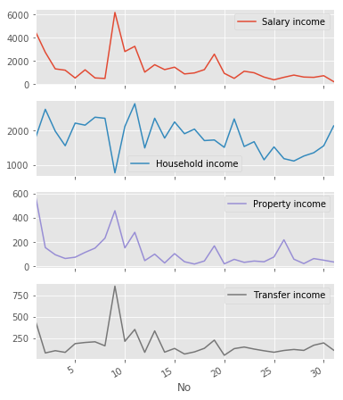

## 可视化 1

- 数据储存在`data.xlsx`Excel文件中，并将抬头改成英文
- 使用`python`的`matplotlib`分别绘制了6种图
    - 曲线图
    - 柱状图
    - 直方图
    - 散点图
    - 面积图
    - 饼状图
- [点击查看Visualization_1](https://192.168.113.164/user/cufe/notebooks/students/2015311583Jedan/python_code/data%20mining/homework_3/Visualization_1.ipynb)

### 导入包


```python
import numpy as np
import pandas as pd
import matplotlib.pyplot as plt
import matplotlib
matplotlib.style.use('ggplot')
%matplotlib inline
```

### 导入数据


```python
data = pd.read_excel('data.xlsx', index_col=0)
columns = data.columns
```

### 曲线图（合并和分开）


```python
data.plot()
plt.show()
data.plot(subplots=True, figsize=(6,8))
plt.show
```


    <function matplotlib.pyplot.show>





### 柱状图


```python
data.plot(kind='bar', stacked=True, color=['blue','gold', 'green', 'red'], figsize=(10,5))
plt.show()

data.plot(kind='bar', subplots=True, figsize=(10,10))
plt.show()
```


### 直方图及其密度曲线图


```python
data.hist(bins=10,figsize=(10,5))
plt.show()

data.plot.kde()
plt.show()

data.plot.kde(subplots=True, figsize=(6,12))
plt.show()
```


### 箱线图


```python
data.boxplot()
plt.show()
```


### 散点图


```python
plt.scatter(data[columns[3]], data[columns[4]],c=data[columns[3]],s=data[columns[3]]*0.90,alpha=0.5)
plt.show()

data.plot.scatter(x=columns[3], y=columns[4],c=columns[3], s=50)
plt.show()

data.plot.hexbin(x=columns[3], y=columns[4],C=columns[3], reduce_C_function=np.max,gridsize=25)
plt.show()
```


### 面积图


```python
data.plot.area(stacked=True)
plt.show()

data.plot.area(stacked=False)
plt.show()
```


### 饼图


```python

for i in range(1, len(columns)):
    ax = plt.subplot(2,2,i)
    data.plot.pie(y=columns[i], figsize=(12, 12),ax=ax)
plt.show()
```


