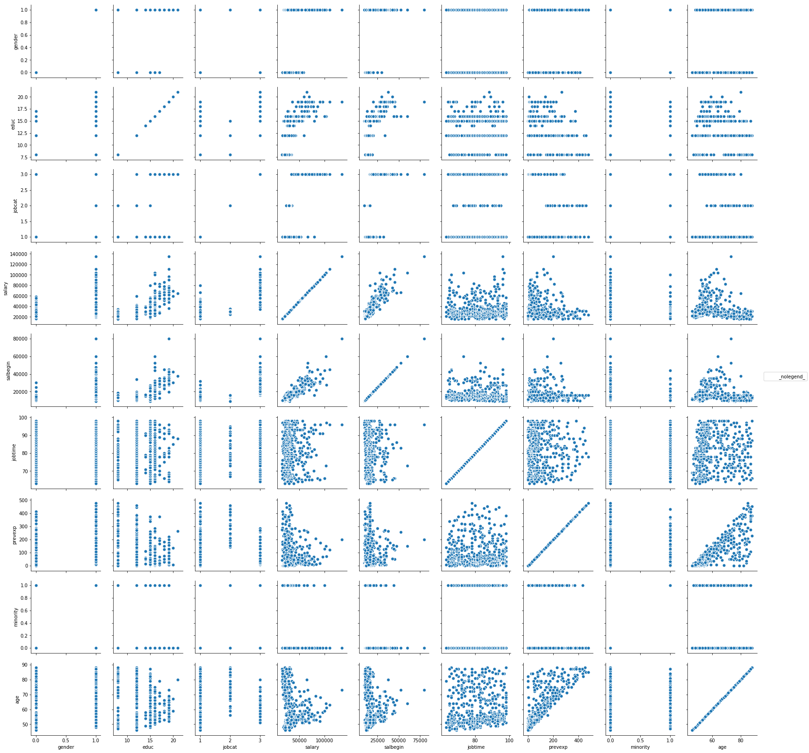

```python
import scipy.stats as stats
import pandas as pd
import numpy as np

import matplotlib.pyplot as plt
import seaborn as sns
%matplotlib inline
```

## 题1
安徽省国民收入与城乡居民存款余额的相关性分析data10-01


```python
data1 = pd.read_excel('data.xlsx', sheetname='data10-01', index_col=0)
```


```python
data1.head()
```


<div>
<table border="1" class="dataframe">
  <thead>
    <tr style="text-align: right;">
      <th></th>
      <th>incom</th>
      <th>deposit</th>
    </tr>
    <tr>
      <th>year</th>
      <th></th>
      <th></th>
    </tr>
  </thead>
  <tbody>
    <tr>
      <th>1962</th>
      <td>34.61</td>
      <td>0.59</td>
    </tr>
    <tr>
      <th>1963</th>
      <td>35.67</td>
      <td>0.71</td>
    </tr>
    <tr>
      <th>1964</th>
      <td>39.52</td>
      <td>0.85</td>
    </tr>
    <tr>
      <th>1965</th>
      <td>47.32</td>
      <td>1.00</td>
    </tr>
    <tr>
      <th>1966</th>
      <td>54.14</td>
      <td>1.22</td>
    </tr>
  </tbody>
</table>
</div>


```python
data1.corr(method='pearson')
```


<div>
<table border="1" class="dataframe">
  <thead>
    <tr style="text-align: right;">
      <th></th>
      <th>incom</th>
      <th>deposit</th>
    </tr>
  </thead>
  <tbody>
    <tr>
      <th>incom</th>
      <td>1.000000</td>
      <td>0.976209</td>
    </tr>
    <tr>
      <th>deposit</th>
      <td>0.976209</td>
      <td>1.000000</td>
    </tr>
  </tbody>
</table>
</div>


### 分析
收入和存款的pearson相关系数达到0.98，说明收入和存款存在非常强的相关性

## 题2 
用相关矩阵观察起始工资（salbegin）和现工资（salary）与雇员本人个方面条件的关系。Data07-03


```python
data2 = pd.read_excel('data.xlsx', sheetname='data07-03', index_col=0)
```

将性别数值化，男为1， 女为0


```python
data2['gender'] = data2['gender'].astype('category')
data2['gender'].cat.categories = [0, 1]
```

计算年龄


```python
from datetime import datetime
now = pd.Timestamp(datetime.now())
data2['bdate'] = pd.to_datetime(data2['bdate'])  
data2['age'] = (now - data2['bdate']).astype('<m8[Y]')
```


```python
data2.head()
```


<div>
<table border="1" class="dataframe">
  <thead>
    <tr style="text-align: right;">
      <th></th>
      <th>gender</th>
      <th>bdate</th>
      <th>educ</th>
      <th>jobcat</th>
      <th>salary</th>
      <th>salbegin</th>
      <th>jobtime</th>
      <th>prevexp</th>
      <th>minority</th>
      <th>age</th>
    </tr>
    <tr>
      <th>id</th>
      <th></th>
      <th></th>
      <th></th>
      <th></th>
      <th></th>
      <th></th>
      <th></th>
      <th></th>
      <th></th>
      <th></th>
    </tr>
  </thead>
  <tbody>
    <tr>
      <th>1</th>
      <td>1</td>
      <td>1952-02-03</td>
      <td>15</td>
      <td>3</td>
      <td>57000</td>
      <td>27000</td>
      <td>98</td>
      <td>144</td>
      <td>0</td>
      <td>65.0</td>
    </tr>
    <tr>
      <th>2</th>
      <td>1</td>
      <td>1958-05-23</td>
      <td>16</td>
      <td>1</td>
      <td>40200</td>
      <td>18750</td>
      <td>98</td>
      <td>36</td>
      <td>0</td>
      <td>59.0</td>
    </tr>
    <tr>
      <th>3</th>
      <td>0</td>
      <td>1929-07-26</td>
      <td>12</td>
      <td>1</td>
      <td>21450</td>
      <td>12000</td>
      <td>98</td>
      <td>381</td>
      <td>0</td>
      <td>88.0</td>
    </tr>
    <tr>
      <th>4</th>
      <td>0</td>
      <td>1947-04-15</td>
      <td>8</td>
      <td>1</td>
      <td>21900</td>
      <td>13200</td>
      <td>98</td>
      <td>190</td>
      <td>0</td>
      <td>70.0</td>
    </tr>
    <tr>
      <th>5</th>
      <td>1</td>
      <td>1955-02-09</td>
      <td>15</td>
      <td>1</td>
      <td>45000</td>
      <td>21000</td>
      <td>98</td>
      <td>138</td>
      <td>0</td>
      <td>62.0</td>
    </tr>
  </tbody>
</table>
</div>


计算相关性矩阵


```python
data2.corr()
```


<div>
<table border="1" class="dataframe">
  <thead>
    <tr style="text-align: right;">
      <th></th>
      <th>educ</th>
      <th>jobcat</th>
      <th>salary</th>
      <th>salbegin</th>
      <th>jobtime</th>
      <th>prevexp</th>
      <th>minority</th>
      <th>age</th>
    </tr>
  </thead>
  <tbody>
    <tr>
      <th>educ</th>
      <td>1.000000</td>
      <td>0.513854</td>
      <td>0.660559</td>
      <td>0.633196</td>
      <td>0.047379</td>
      <td>-0.252353</td>
      <td>-0.132889</td>
      <td>-0.280766</td>
    </tr>
    <tr>
      <th>jobcat</th>
      <td>0.513854</td>
      <td>1.000000</td>
      <td>0.780115</td>
      <td>0.754662</td>
      <td>0.005329</td>
      <td>0.062645</td>
      <td>-0.143781</td>
      <td>0.010596</td>
    </tr>
    <tr>
      <th>salary</th>
      <td>0.660559</td>
      <td>0.780115</td>
      <td>1.000000</td>
      <td>0.880117</td>
      <td>0.084092</td>
      <td>-0.097467</td>
      <td>-0.177337</td>
      <td>-0.143529</td>
    </tr>
    <tr>
      <th>salbegin</th>
      <td>0.633196</td>
      <td>0.754662</td>
      <td>0.880117</td>
      <td>1.000000</td>
      <td>-0.019753</td>
      <td>0.045136</td>
      <td>-0.157598</td>
      <td>-0.008930</td>
    </tr>
    <tr>
      <th>jobtime</th>
      <td>0.047379</td>
      <td>0.005329</td>
      <td>0.084092</td>
      <td>-0.019753</td>
      <td>1.000000</td>
      <td>0.002978</td>
      <td>0.049501</td>
      <td>0.054419</td>
    </tr>
    <tr>
      <th>prevexp</th>
      <td>-0.252353</td>
      <td>0.062645</td>
      <td>-0.097467</td>
      <td>0.045136</td>
      <td>0.002978</td>
      <td>1.000000</td>
      <td>0.144747</td>
      <td>0.803058</td>
    </tr>
    <tr>
      <th>minority</th>
      <td>-0.132889</td>
      <td>-0.143781</td>
      <td>-0.177337</td>
      <td>-0.157598</td>
      <td>0.049501</td>
      <td>0.144747</td>
      <td>1.000000</td>
      <td>0.111354</td>
    </tr>
    <tr>
      <th>age</th>
      <td>-0.280766</td>
      <td>0.010596</td>
      <td>-0.143529</td>
      <td>-0.008930</td>
      <td>0.054419</td>
      <td>0.803058</td>
      <td>0.111354</td>
      <td>1.000000</td>
    </tr>
  </tbody>
</table>
</div>


```python
g = sns.PairGrid(data2,  palette="GnBu_d")
g.map(plt.scatter, s=50, edgecolor="white")
g.add_legend();
```





### 分析
从相关矩阵可以看出：

 - 起始工资(salbegin)和现有工资(salary)有很强的相关性（0.88），说明现有工资很大程度上与起始工资有关
 - 起始工资和现有工资都与工作类型(jobcat)和教育程度(educ)有较强的相关性(~0.7),说明教育程度和工作类型对起始工资和现有工资有较大的影响
 - 起始工资和现有工资与工作年限(jobtime)、工作经验(prevexp)和年龄（age）的相关性非常弱（<0.1），说明工作年限和工作经验对工资几乎没有影响

## 题3
使用四川绵阳地区三年生中山柏的数据，分析月生长量与月平均气温、月降雨量、月平均日照时数、月平均湿度这四个气候因素哪个有关。Data10-03


```python
data3 = pd.read_excel('data.xlsx', sheetname='data10-03', index_col=0)
```


```python
data3.head()
```


<div>
<table border="1" class="dataframe">
  <thead>
    <tr style="text-align: right;">
      <th></th>
      <th>hgrow</th>
      <th>temp</th>
      <th>rain</th>
      <th>hsun</th>
      <th>humi</th>
    </tr>
    <tr>
      <th>month</th>
      <th></th>
      <th></th>
      <th></th>
      <th></th>
      <th></th>
    </tr>
  </thead>
  <tbody>
    <tr>
      <th>1</th>
      <td>0.01</td>
      <td>4.2</td>
      <td>17.0</td>
      <td>54.5</td>
      <td>81</td>
    </tr>
    <tr>
      <th>2</th>
      <td>0.50</td>
      <td>7.4</td>
      <td>10.8</td>
      <td>73.8</td>
      <td>79</td>
    </tr>
    <tr>
      <th>3</th>
      <td>1.50</td>
      <td>10.0</td>
      <td>17.4</td>
      <td>84.7</td>
      <td>75</td>
    </tr>
    <tr>
      <th>4</th>
      <td>10.80</td>
      <td>16.1</td>
      <td>19.7</td>
      <td>137.0</td>
      <td>75</td>
    </tr>
    <tr>
      <th>5</th>
      <td>13.00</td>
      <td>21.1</td>
      <td>248.7</td>
      <td>149.6</td>
      <td>77</td>
    </tr>
  </tbody>
</table>
</div>


```python
data3.corr()
```


<div>
<table border="1" class="dataframe">
  <thead>
    <tr style="text-align: right;">
      <th></th>
      <th>hgrow</th>
      <th>temp</th>
      <th>rain</th>
      <th>hsun</th>
      <th>humi</th>
    </tr>
  </thead>
  <tbody>
    <tr>
      <th>hgrow</th>
      <td>1.000000</td>
      <td>0.983387</td>
      <td>0.709370</td>
      <td>0.704429</td>
      <td>0.373573</td>
    </tr>
    <tr>
      <th>temp</th>
      <td>0.983387</td>
      <td>1.000000</td>
      <td>0.714821</td>
      <td>0.690490</td>
      <td>0.291983</td>
    </tr>
    <tr>
      <th>rain</th>
      <td>0.709370</td>
      <td>0.714821</td>
      <td>1.000000</td>
      <td>0.701842</td>
      <td>0.384326</td>
    </tr>
    <tr>
      <th>hsun</th>
      <td>0.704429</td>
      <td>0.690490</td>
      <td>0.701842</td>
      <td>1.000000</td>
      <td>-0.050938</td>
    </tr>
    <tr>
      <th>humi</th>
      <td>0.373573</td>
      <td>0.291983</td>
      <td>0.384326</td>
      <td>-0.050938</td>
      <td>1.000000</td>
    </tr>
  </tbody>
</table>
</div>


使用spss的偏相关分析得出的结果


```python
partial = pd.Series(data = [.977,-.491,.632,.731],index = [ 'temp', 'rain', 'hsun', 'humi'])
partial
```


    temp    0.977
    rain   -0.491
    hsun    0.632
    humi    0.731
    dtype: float64


### 分析

从spss的偏相关分析结果可以看出：
 
 - 该地区山柏生长于温度有强相关性(0.977)，说明温度对其生长有很大的影响
 - 对比生长与降雨的相关性和偏相关性可以看出，降雨对生长不但没有正的影响，反而有负面的影响，即降雨越多，生长的越慢
 - 日照时间和空气湿度对山柏生长有较强的相关性，说明日照时间和空气湿度是影响该地区山柏生长的重要因素

